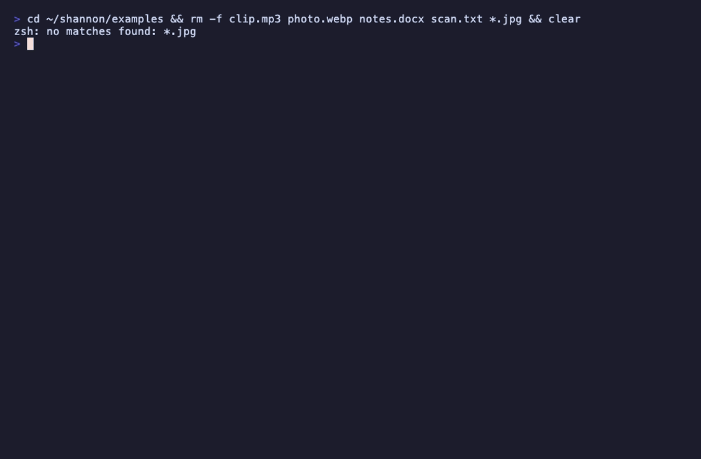

# shannon

Yet another file-conversion wrapper. This one wraps all the others.



```
shannon ~/file.mp4 mp3
shannon *.heic jpg
shannon doc.txt docx
shannon scan.png txt
shannon clip.webm wav --quality high
shannon video.mp4 gif --start 0:10 --duration 5
```

## Install

```
curl -fsSL https://raw.githubusercontent.com/magdalenabay/shannon/main/install.sh | sh
```

Or, if you've already got [uv](https://docs.astral.sh/uv/):

```
uv tool install git+https://github.com/magdalenabay/shannon
```

Windows:

```
iwr -useb https://raw.githubusercontent.com/magdalenabay/shannon/main/install.ps1 | iex
```

Needs Python 3.11+.

## Backends

```
shannon --doctor                # what's installed, what isn't
shannon --install-all           # install the light backends
shannon --install-all --heavy   # libreoffice and calibre too
```

libreoffice (~600 MB) and calibre (~400 MB) are gated behind `--heavy` so you don't accidentally install half a desktop suite when all you wanted was an mp3.

## Syntax

```
shannon <input> <target> [options]
```

`<target>` is one of:

- a bare format (`mp3`, `jpg`, `webp`) → output dropped next to the input
- a filename (`out.mp3`) → output in the current directory
- a full path (`~/audio/track.mp3`) → output exactly there

Batches: `shannon *.heic jpg` writes a `.jpg` next to each `.heic`. With more than one input the target has to be a bare format.

### Options

| Flag                          | What it does                                       |
| ----------------------------- | -------------------------------------------------- |
| `--quality {low,medium,high}` | Quality preset, default medium.                    |
| `--start TIME`                | Audio/video start offset, e.g. `0:10`.             |
| `--duration TIME`             | Clip duration, e.g. `5`.                           |
| `--scale WxH`                 | Resize, e.g. `1920x1080`.                          |
| `--ocr`                       | OCR when pulling text from images or PDFs.         |
| `--fast`                      | Trade quality for speed.                           |
| `--dry-run`                   | Show what would run, don't run it.                 |
| `-y`, `--yes`                 | Auto-accept install prompts.                       |
| `-v`, `--verbose`             | Print the underlying tool commands.                |
| `--heavy`                     | Allow installing heavyweight backends on demand.   |

## Supported formats

| Category | Formats | Backend |
| -------- | ------- | ------- |
| Audio    | mp3, wav, flac, ogg, m4a, opus, aac, wma, aiff       | ffmpeg |
| Video    | mp4, webm, mkv, mov, avi, gif, wmv, flv              | ffmpeg |
| Image    | png, jpg, webp, avif, heic, gif, bmp, tiff, ico, svg | imagemagick, cwebp, avifenc, heif-convert |
| Document | md, html, rst, tex, txt, epub, docx, odt             | pandoc |
| Office   | docx, xlsx, pptx, odt, ods, odp, pdf, rtf            | libreoffice (heavy) |
| PDF      | pdf↔png/jpg/txt                                       | poppler, img2pdf |
| Ebook    | epub, mobi, azw3, fb2, lit, lrf                      | calibre (heavy) |
| Subtitle | srt, vtt, ass, ssa, sub                              | ffmpeg |
| Archive  | zip, tar(.gz/.xz/.bz2), 7z, rar (read-only)          | python, 7z, unrar |
| OCR      | png/jpg/pdf → txt                                     | tesseract |
| Native   | json↔yaml↔toml, csv↔json                              | python only |

`shannon --list` gives the per-converter breakdown. When a conversion needs two backends in a row (`heic → jpg → webp`), shannon chains them through a temp file.
